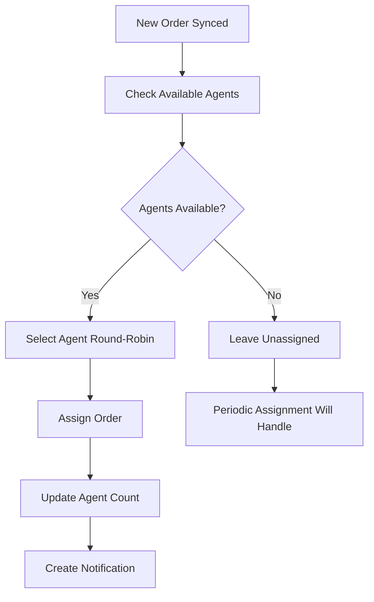
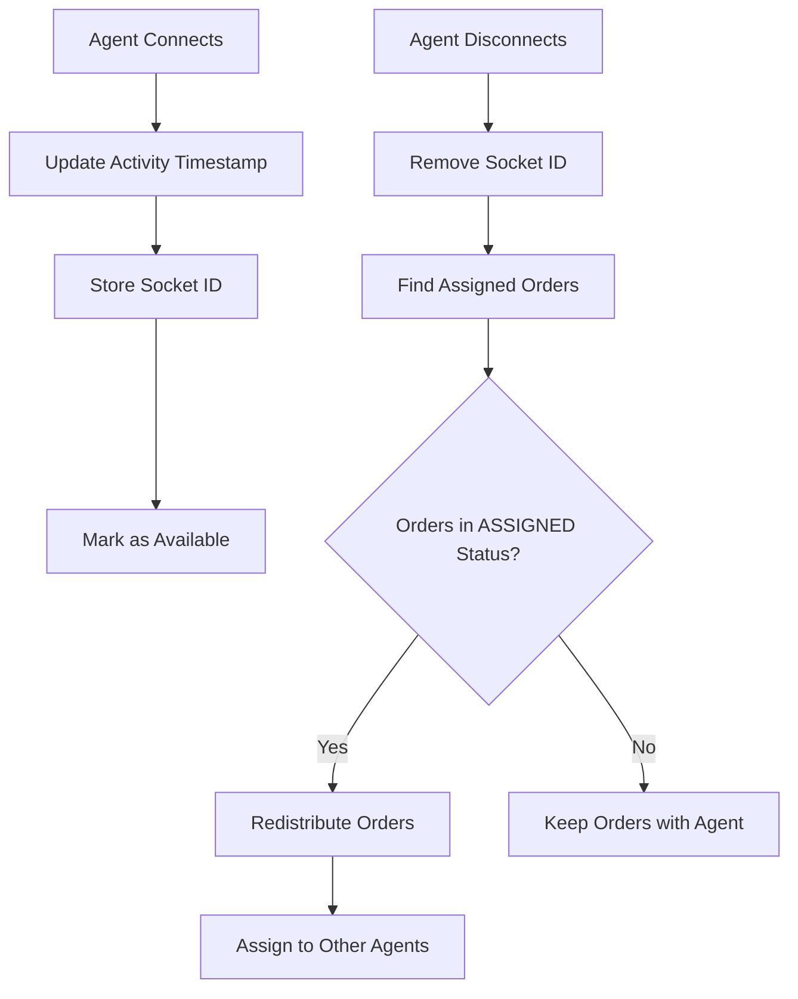

# 🎯 Agent Assignment System Documentation

## Overview

The Agent Assignment System is an intelligent order distribution system that automatically assigns orders to available AGENT_SUIVI users using a round-robin algorithm. The system tracks agent availability in real-time and ensures fair workload distribution.

## Key Features

### ✅ **Automatic Assignment**
- Orders are automatically assigned during EcoManager sync
- Periodic assignment runs every 5 minutes for missed orders
- Manual assignment triggers available for managers

### ✅ **Round-Robin Distribution**
- Fair distribution among available agents
- Maintains assignment order using Redis tracking
- Prevents agent overload

### ✅ **Real-Time Agent Tracking**
- WebSocket-based online status tracking
- Activity timestamps with 15-minute timeout
- Automatic offline detection and order redistribution

### ✅ **Workload Management**
- Configurable maximum orders per agent
- Only counts "ASSIGNED" status orders toward limits
- Utilization rate monitoring

### ✅ **Smart Redistribution**
- Automatic redistribution when agents go offline
- Only redistributes "ASSIGNED" orders (not "IN_PROGRESS")
- Manual redistribution controls for managers

## Architecture

### Core Components

1. **AgentAssignmentService** (`/src/services/agent-assignment.service.ts`)
   - Main assignment logic
   - Round-robin algorithm implementation
   - Agent activity tracking
   - Order redistribution

2. **Socket.io Integration** (`/src/app.ts`)
   - Real-time agent connection tracking
   - Activity updates
   - Assignment notifications

3. **Sync Integration** (`/src/services/sync.service.ts`)
   - Immediate assignment during order sync
   - Batch processing support

4. **API Endpoints** (`/src/modules/assignments/`)
   - Manual assignment triggers
   - Statistics and monitoring
   - Agent management

5. **Frontend Dashboard** (`/frontend/src/components/admin/assignment-dashboard.tsx`)
   - Real-time statistics
   - Agent workload visualization
   - Manual controls

## Configuration

### Agent Settings

Each AGENT_SUIVI has configurable settings:

```typescript
interface AgentSettings {
  maxOrders: number;        // Maximum assigned orders (default: 15-20)
  isActive: boolean;        // Admin-controlled active status
  availability: AgentAvailability; // ONLINE, BUSY, BREAK, OFFLINE
}
```

### Assignment Settings

```typescript
interface AssignmentSettings {
  strategy: 'round_robin';           // Assignment strategy
  considerAvailability: true;        // Check online status
  considerWorkload: true;            // Check order limits
  maxOrdersPerAgent: 20;            // Global default
  eligibleRoles: ['AGENT_SUIVI'];   // Eligible user roles
}
```

## API Endpoints

### Assignment Management

```http
POST /api/v1/assignments/trigger
# Manually trigger assignment of unassigned orders
# Access: ADMIN, TEAM_MANAGER

GET /api/v1/assignments/stats
# Get assignment statistics and agent workloads
# Access: ADMIN, TEAM_MANAGER, AGENT_SUIVI

POST /api/v1/assignments/reassign/:orderId
# Manually reassign order to specific agent
# Body: { "agentId": "agent_id" }
# Access: ADMIN, TEAM_MANAGER

PUT /api/v1/assignments/agent/:agentId/availability
# Update agent availability status
# Body: { "availability": "ONLINE|BUSY|BREAK|OFFLINE" }
# Access: ADMIN, TEAM_MANAGER, Own Agent

GET /api/v1/assignments/workloads
# Get detailed agent workload distribution
# Access: ADMIN, TEAM_MANAGER

POST /api/v1/assignments/redistribute/:agentId
# Force redistribute orders from specific agent
# Access: ADMIN, TEAM_MANAGER

GET /api/v1/assignments/analytics
# Get assignment history and analytics
# Query: ?period=24h|7d|30d
# Access: ADMIN, TEAM_MANAGER
```

## WebSocket Events

### Client to Server

```typescript
// Agent joins and marks as online
socket.emit('join_agents', { 
  userId: 'agent_id', 
  role: 'AGENT_SUIVI' 
});

// Update agent activity
socket.emit('agent_activity', 'agent_id');

// Request manual assignment
socket.emit('request_assignment', { 
  managerId: 'manager_id' 
});
```

### Server to Client

```typescript
// Assignment completed notification
socket.on('assignment_completed', (data) => {
  // data: { managerId, result }
});

// New assignments notification
socket.on('new_assignments', (data) => {
  // data: { count, source: 'manual|periodic|sync' }
});

// Order reassigned notification
socket.on('order_reassigned', (data) => {
  // data: { orderId, message }
});

// Agent availability changed
socket.on('agent_availability_changed', (data) => {
  // data: { agentId, availability }
});
```

## Assignment Flow

### 1. Order Sync Assignment



### 2. Agent Online/Offline Flow



### 3. Round-Robin Algorithm

```typescript
async selectAgentRoundRobin(agents: AgentStatus[]) {
  // Get last assigned index from Redis
  const lastIndex = await redis.get('assignment:last_agent_index');
  
  // Calculate next index
  const nextIndex = (parseInt(lastIndex || '0') + 1) % agents.length;
  
  // Update Redis with new index
  await redis.set('assignment:last_agent_index', nextIndex);
  
  return agents[nextIndex];
}
```

## Monitoring and Analytics

### Key Metrics

- **Total Agents**: Number of active AGENT_SUIVI users
- **Online Agents**: Agents currently connected and active
- **Unassigned Orders**: Orders waiting for assignment
- **Utilization Rate**: Percentage of agent capacity used
- **Assignment Success Rate**: Successful vs failed assignments

### Dashboard Features

- Real-time agent status monitoring
- Workload distribution visualization
- Manual assignment controls
- Assignment history and trends
- Performance analytics

## Testing

### Test Script

Run the assignment system test:

```bash
cd backend
npx ts-node src/scripts/test-assignment-system.ts
```

### Test Coverage

- Assignment algorithm verification
- Round-robin distribution testing
- Agent activity simulation
- Workload limit enforcement
- Redistribution logic validation

## Troubleshooting

### Common Issues

1. **No Agents Available**
   - Check agent `isActive` status
   - Verify agents are online (WebSocket connected)
   - Check agent workload limits

2. **Orders Not Being Assigned**
   - Verify sync service is running
   - Check Redis connectivity
   - Review agent availability status

3. **Uneven Distribution**
   - Check round-robin index in Redis
   - Verify agent capacity limits
   - Review assignment logs

### Debug Commands

```bash
# Check Redis assignment data
redis-cli keys "assignment:*"
redis-cli keys "socket:agent:*"
redis-cli keys "activity:agent:*"

# Check assignment statistics
curl -H "Authorization: Bearer $TOKEN" \
  http://localhost:3000/api/v1/assignments/stats

# Trigger manual assignment
curl -X POST -H "Authorization: Bearer $TOKEN" \
  http://localhost:3000/api/v1/assignments/trigger
```

## Performance Considerations

### Optimization

- Redis caching for agent status
- Batch processing for multiple assignments
- Efficient database queries with proper indexing
- WebSocket connection pooling

### Scalability

- Horizontal scaling support via Redis
- Stateless assignment service
- Load balancer compatible
- Database connection pooling

## Security

### Access Control

- Role-based permissions (ADMIN, TEAM_MANAGER, AGENT_SUIVI)
- JWT authentication required
- Agent can only update own availability
- Managers can control all assignments

### Data Protection

- Secure WebSocket connections
- Encrypted Redis communication
- Audit logging for all assignment actions
- Rate limiting on API endpoints

## Future Enhancements

### Planned Features

- **Skill-based Assignment**: Match orders to agent expertise
- **Priority Queues**: High-priority order handling
- **Load Balancing**: Dynamic capacity adjustment
- **AI-Powered Assignment**: Machine learning optimization
- **Mobile App Integration**: Real-time agent mobile interface

### Configuration Options

- Multiple assignment strategies
- Custom workload algorithms
- Flexible availability rules
- Advanced analytics and reporting